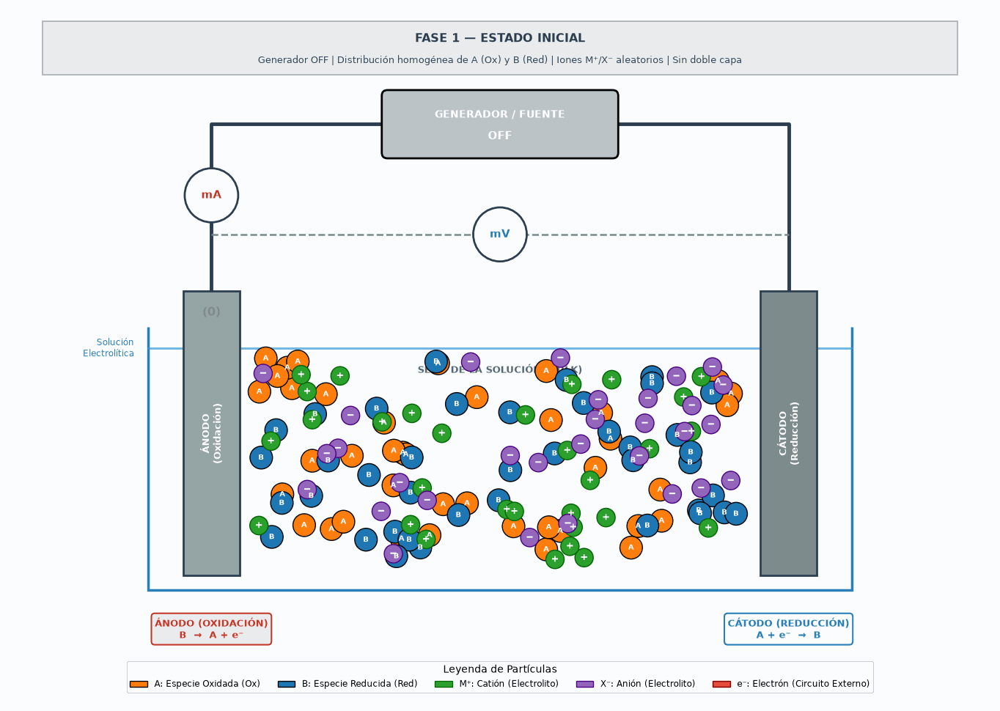

# Animación Científica y Didáctica: Celda Electroquímica y Fenómenos Interfaciales

Este proyecto contiene el código en Python para generar un **GIF animado** y un **video MP4** educativamente rigurosos y visualmente claros que representan una **celda electroquímica completa** y, simultáneamente, los fenómenos físicoquímicos que ocurren en la **interfaz electrodo–electrolito**.



## 📌 Descripción General

La animación integra dos escalas espacio-temporales fundamentales:
1. **Escala Macroscópica**:
   - Generador/Fuente de potencial eléctrico con indicación de estado (`OFF` $\rightarrow$ `ΔE aplicado`).
   - Circuito eléctrico externo con flujo de electrones ($e^-$) a través del conductor metálico.
   - Amperímetro ($mA$) en serie y Voltímetro ($mV$) en paralelo como instrumentos simbólicos de medición.
   - Electrodos: **Ánodo (Oxidación)** y **Cátodo (Reducción)**.

2. **Escala Microscópica**:
   - Especies del par redox: **Especie A (Ox - Oxidada, Naranja)** y **Especie B (Red - Reducida, Azul)**.
   - Electrolito de soporte: **Cationes $M^+$ (Verde)** y **Aniones $X^-$ (Morado)**.
   - Formación progresiva de la **Doble Capa Eléctrica (EDL)** cerca de las superficies electródicas.
   - Transferencia electrónica interfacial (reacciones Faradaicas heterogéneas).
   - Transporte de masa por **difusión Fickiana** impulsado por gradientes de concentración.

---

## ⏱️ Secuencia de Fases (13 Segundos)

- **Fase 1 — Estado Inicial ($0 - 2.0\text{ s}$)**: Generador apagado (`OFF`), distribución homogénea de especies $A$ y $B$, iones aleatorios, sin doble capa ni flujo de $e^-$.
- **Fase 2 — Aplicación de Potencial $\Delta E$ ($2.0 - 3.5\text{ s}$)**: Se activa la fuente, se establece el campo eléctrico y comienza el desplazamiento continuo de electrones $e^-$ por el conductor externo.
- **Fase 3 — Formación de la Doble Capa Eléctrica ($3.5 - 5.0\text{ s}$)**: Migración iónica: Aniones $X^- \rightarrow \text{Ánodo (+)}$ y Cationes $M^+ \rightarrow \text{Cátodo (-)}$, constituyendo la estructura de apantallamiento interfacial (EDL).
- **Fase 4 — Transferencia Electrónica Interfacial ($5.0 - 8.0\text{ s}$)**:
  - **Ánodo**: $B \rightarrow A + e^-$ (Oxidación)
  - **Cátodo**: $A + e^- \rightarrow B$ (Reducción)
- **Fase 5 — Gradientes de Concentración y Difusión ($8.0 - 11.0\text{ s}$)**: Consumo/generación local de especies produce gradientes $\nabla C$, induciendo transporte por difusión desde y hacia el seno de la solución.
- **Fase 6 — Estado Estacionario Conceptual ($11.0 - 13.0\text{ s}$)**: Operación electroquímica continua con ciclo fluido para repetición en bucle del GIF.

---

## 🚀 Requisitos e Instalación

Asegúrate de tener Python 3.9+ e instalar las librerías necesarias:

```bash
pip install numpy matplotlib pillow imageio imageio-ffmpeg opencv-python
```

---

## 💻 Ejecución

Para ejecutar la simulación y generar automáticamente los archivos `transferencia_electronica_doble_capa.gif` y `transferencia_electronica_doble_capa.mp4`:

```bash
python generar_animacion.py
```

---

## 📁 Archivos del Repositorio

- `generar_animacion.py`: Script principal en Python con parámetros configurables y motor de simulación física.
- `transferencia_electronica_doble_capa.gif`: Archivo GIF animado listo para presentaciones.
- `transferencia_electronica_doble_capa.mp4`: Video en formato MP4 alta definición.
- `Figura 11. a) Esquema simplificado...jpg`: Esquema de referencia visual.
- `.gitignore`: Configuración para excluir archivos temporales de renderizado.

---

## 📜 Licencia y Autoría

Desarrollado para exposición académica y doctorado en Electroquímica.  
Autor: Cristhian Camilo Delgado Díaz.
